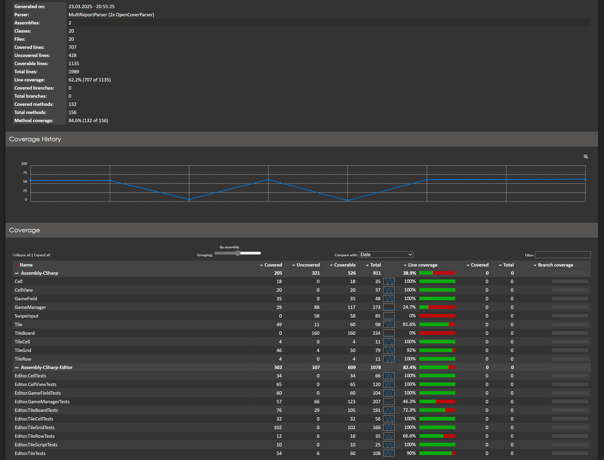

# 2048 на Unity

Реализация игры 2048 на Unity.

Здесь код для сразу обеих лабораторных работ (готовая игра).

### Покрытие Unit-тестами

"Кодовая база" (если я правильно понял, что речь про Cell, CellView, Gamefield из лабораторной работы 1 и их надстроек в виде Lerp, счета очков, сохранения... из лабораторной работы 2) покрыта полностью, остальное - по возможности/пониманию

